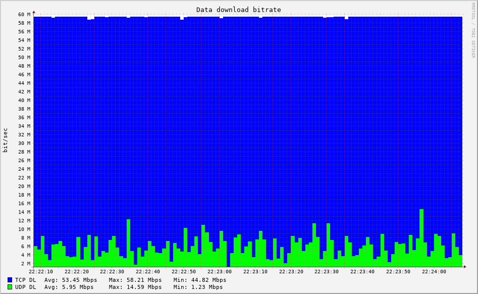

Configuration
=============
.. sectionauthor:: Clément Delzotti, Vincent Higginson

Hardware
~~~~~

For this project, we had at our disposal a Turris Router. This router allows connections through SSH in order to run software on it. The main advantage of this is the reduced cost of monitoring, as we can observe traffic on router directly instead of monitoring each computer and compile data afterwards. We mainly used this router to run *tstat* [1]_ and *rrdtool* [2]_ .

.. [1] https://tstat.polito.it/software.php

.. [2] https://github.com/oetiker/rrdtool-1.x

Round Robin Databases
~~~~

RRDs are a central element in this project. They attempt to answer an important problem of networking monitoring : storage. The total amount of data going through a router can be important and routers usually have limited storage. The idea of a Round Robin Database is to keep a constant memory use despite continuous monitoring. To do so, it aggregates older data to make rooms for freshly performed measurements. The further the monitoring goes, the more old data are aggregated. The counterpart is of course a lack of precise information for older measures. This can be avoided with automatic plotting using tools such as `crontab` and `rrdtool`.

RRDs are thus usually lightweight and can be transferred easily. However, it is worth saying that RRDs are OS and architecture specific. To use RRDs captured from a router (Typically running Linux on ARM) to a personal computer (Typically running over an x86_64 architecture), some conversion must be performed with the help of `rrdtool dump`.

Tstat
~~~~~

Tstat is a monitoring software developed by the *Politecnico di Torino* that turned out to be really useful due to its integrated logic in traffic monitoring. It can, among many other things, read DNS requests and therefore identify where a particular flow is going. It then produces logs in standard text formats that can be parsed to get information about monitored traffic. Another helpful functionality is the ability to export monitored data in Round Robin Databases who can be used for plotting.

The first issue we had was the compilation. As the Turris Router is running a modified version of OpenWRT (A Linux distribution designed for routers) on an armv7l architecture, it was somehow complicated to find dependencies needed by Tstat who weren't available in OPKG (OpenWRT package manager). The solution we found was to use LXC containers to run a Debian distribution with a much more supplied package manager, enabling an easy compilation of Tstat. But this led to another minor problem : LXC networks. LXC containers embeds by default a networking stack enabling communications between containers. This was an obstacle because we needed to monitor the WAN port of our Router, and it was therefore inaccessible from inside our container. We worked around it by enabling "host" networking for our container in its configuration file :

.. code-block:: ruby
   :linenos:

    # Network configuration
    lxc.net.0.type = none

Once this was done, we had an up an running instance of Tstat on the Turris.

RRDtool
~~~~~

RRDTool is a tool enabling Round Robin Databases manipulations such as creation, edition and plotting. We mainly used the plotting function as databases creation and editing are handled implicitly by Tstat. The use of RRDTool is pretty much straight forward and well-ish documented on https://oss.oetiker.ch/rrdtool/index.en.html. Typically, a rrdtool plotting command will look like this :

.. code-block:: ruby
   :linenos:

    rrdtool graph \
    $destination_dir/graph-name.png \
    --start now-2min --end now \
    --width 850 --height 500 \
    --title "Data download bitrate" \
    --vertical-label "bit/sec" \
    DEF:tcpin=RRD/ip_bitrate_in.idx0.rrd:ip_bitrate_in:LAST \
    DEF:udpin=RRD/ip_bitrate_in.idx1.rrd:ip_bitrate_in:LAST \
    CDEF:total=tcpin,udpin,+ \
    AREA:total#0000ff:"TCP DL" \
    GPRINT:tcpin:AVERAGE:"Avg\: %3.2lf %sbps\t" \
    GPRINT:tcpin:MAX:"Max\: %3.2lf %sbps\t" \
    GPRINT:tcpin:MIN:"Min\: %3.2lf %sbps\l"\
    AREA:udpin#00ff00:"UDP DL" \
    GPRINT:udpin:AVERAGE:"Avg\: %3.2lf %sbps\t" \
    GPRINT:udpin:MAX:"Max\: %3.2lf %sbps\t" \
    GPRINT:udpin:MIN:"Min\: %3.2lf %sbps\l"

We can see that rrdtool let us define the time window we want to see with flags `--start` and `--end`. In the example, the command will produce a graph showing data gathered on the last two minutes preceding the execution of the command. We can also notice the DEF keyword allowing to retrieve data from a Round Robin Database and the CDEF keyword allowing on the fly computations of previously retrieved data. The remaining of the command specifies what must be plotted on the graph. For instance, this command as produced the following graph :

  Example of a graph drawn with RRDtool