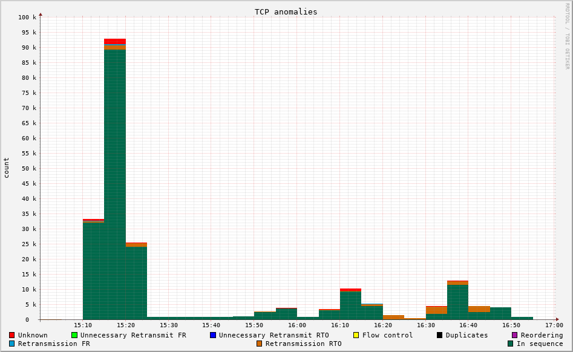
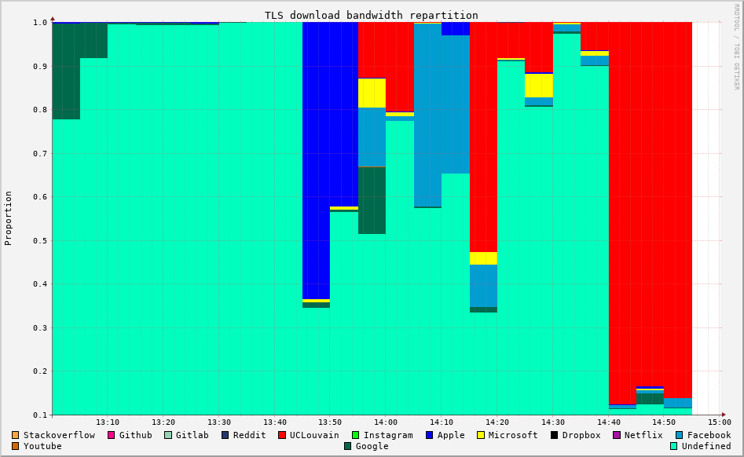
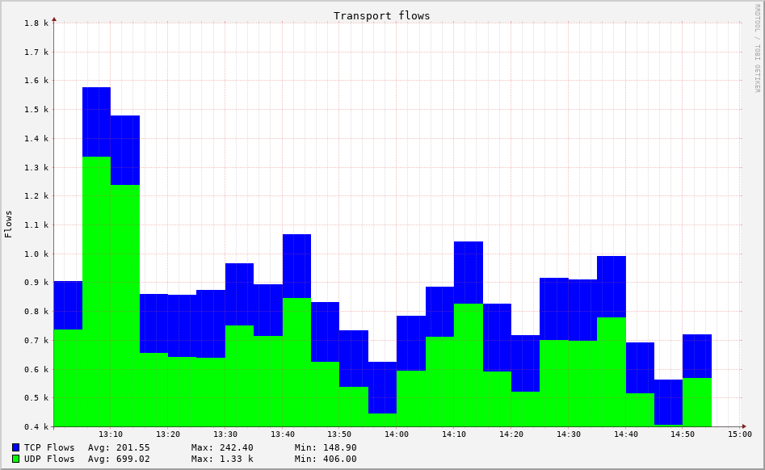
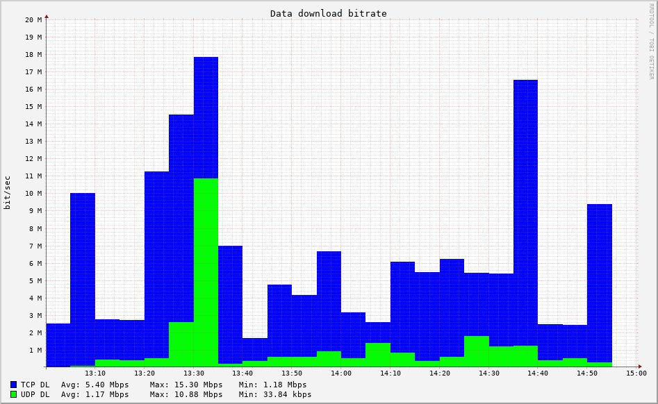
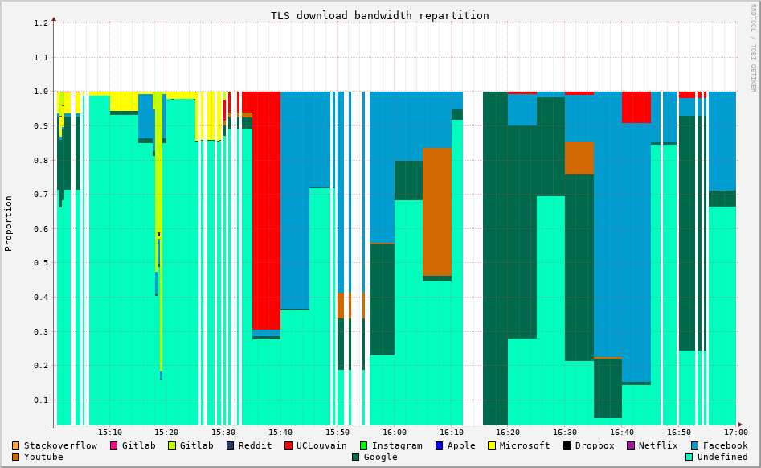

Monitoring on a Startlink connection
====================================

.. sectionauthor:: Clément Delzotti, Vincent Higginson

As a practical example, we've performed a passive monitoring on a router connected to the Starlink satellite network. This router was accessible to UCLouvain computer science students.

Configuration
-------------

The router is a *Turris Omnia* that we connected in a closed room next to another room where students used to work and have practical lessons. We plugged the *Turris* on a 100Mbps port connected to the Starlink network. Thus, it was only accessible through Wi-Fi.

We configured this router with a Tstat instance, allowing us to easily gather information about the network and states of connections. To face the gradual aggregation of RRD database, we defined a cronjob to draw some usual graphs every two hours, allowing us to get a clear image before the aggregation process aggregates data.

Finally, as we don't want the router to gradually get its memory filled with graph pictures, we defined a second cronjob to send an email at 1am every day containing every graph generated during the previous day so that they can be removed.

Observations
------------

One of the first things we have analyzed is the behavior of TCP. We can see that it is actually relatively stable, with a few exceptions:

   Anomalies in TCP on a Startlink connection.

Most of the TCP traffic is going well, except some *Retransmission RTO*, that are probably caused by the fact that the router is located behind a thick wall and users are all connected through Wi-Fi.

Another point of interest in our monitoring is traffic classification. As explained before, TLS traffic possesses a *SNI* field, which is used to identify the destination server. We can thus use this field to identify where a TLS connection is going. Tstat allows us to do so, with a list of 10 predefined services (e.g. Facebook, Google, Instagram, etc). We modified Tstat to also catch traffic that matches our particular case (As our router is located within a UCLouvain building accessed by students in computer sciences, we can foresee some network utilization such as *Stack Overflow* or *GitHub*):

   Network traffic classification based on the SNI field.

This allows us to see that SNI-based network classification is possible and that we can identify the destination servers. Of course, the part of *unknown traffic* is important here as a simple set of 13 services is not enough to identify all the traffic. Once again, it is important to mention that this technique could be threatened by the emergence of ESNI.

Finally, we realized some monitoring of the CPU utilization, to understand the feasibility of our monitoring and if it could be used on a wide scale. Based on our observations, our monitoring had little impact on the router performance.

Sustainability
--------------

In our particular use case, the Starlink connection successfully handled the load of a computer science students working simultaneously.

   Flows during a Cloud Computing practical

   Data consumption during a Cloud Computing practical

We can see that despite having to handle a lot of flows, our router kept working and monitoring while providing a satisfactory connection to users. We only noticed some additional delay from a user experience point of view. Of course, the nature of the activity has to be taken into account : our router handled the load of hard-working students whose network usage was mainly web search and punctual downloads with some tools (Docker images, etc). It seems reasonable to assume that a Starlink connection should be able to handle a reasonable workload for a reduced group of person.

Pitfalls
--------

While setting up our Starlink monitoring, we were too eager to catch every network event and that led to a high CPU solicitation. More precisely, by reducing Tstat sampling interval, which is every 5 minutes by default, to every second we could get a clearer picture of what was happening on the network. Of course, the downside of this approach was that our router had to perform its monitoring instructions too often. Our CPU couldn't handle this load, and it generated *holes* in our monitoring :

   CPU Overloading causing '*holes*' in the monitoring.