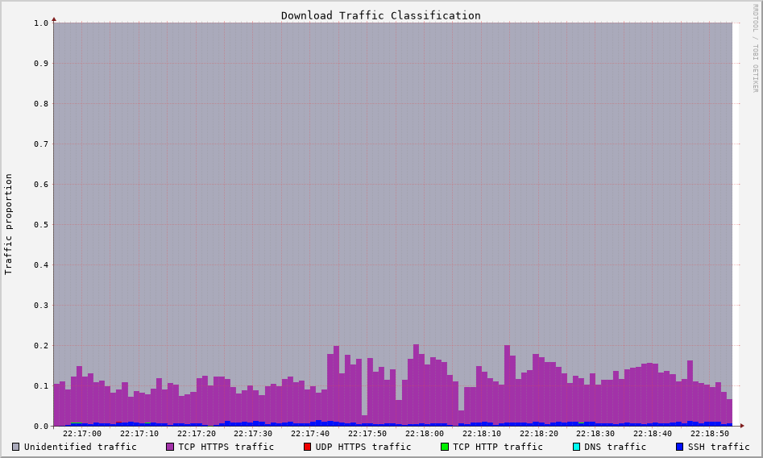

Traffic Classification
======================
.. sectionauthor:: Clément Delzotti, Vincent Higginson

A widly requested feature is traffic classification. It consists to identify flows to give a better understanding of what kind of traffic is going through the network and therefore which traffic can lead to congestion. An easy way to perform network classification is through the combination of the transport protocol and the port. Typically, HTTPS is performed with TCP on port 443, DNS is performed with UDP on port 53, etc. Luckily, Tstat provide a way to export traffic information based on the transport protocol used and the port. Our *rrd.conf* file would look like this :

.. code-block:: ruby
   :linenos:

    tcp_port_src_in                 idx:22,80,443,other
    udp_port_flow_dst               idx:53,443,other

Using the exported files, we can once again do some plotting with RRDtool:

  Example of simple network classification

This graph is the result of data collected on a network where we started an ssh session while watching a live video and downloading files via a BitTorrent client. We can see that SSH, DNS and HTTPS over TCP traffics are easily classified. But we still have a large part of the connection labelled as *Unidentified traffic*. This is mainly due to the use of unconventionnal ports numbers in our BitTorrent client but we've noticed the same problem on Real-Time Communications. We can also notice that even if it is identified, HTTPS traffic is really vague as it gathers many types of flows : streaming, live streaming, file downloading, internet browsing, etc.

Even though we could have built a more developped classification (to catch SMTP, POP3, etc), we can already notice that traffic classification solely based on transport protocol and destination port is quickly limited. A way around this problem would be to perform classification by also analyzing the IP addresses. This can be done by reading DNS requests or analyzing the AS of IP addresses. The first possibility is limited by the use of Dns-Over-Https and other ways to obfuscate dns traffic. The second approach suffers from the possible use of CDNs.

In the case of realtime communications, we can also leverage the RTCP protocol to enable traffic classification. RTCP is a protocol used by live communication services to exchange data about an on-going connection. The advantage of this protocol is its clear-transmitted headers alowing us to identify a traffic with the help of a *Payload Type* field. We can thus differentiate RTP video streaming and audio streaming. Of course, this is only possible if RTCP headers are transmitted in clear through the network. Some applications using undocumented protocols wouldn't be identified by an RTCP based classification.

Another alternative would be to catch the TLS SNI Extension field during a Client Hello, but this would be subject to obfuscation, as many services would still work with an incorrect SNI field. Altough ESNI (Encrypted SNI) is on its way, it's still not widely deployed yet. We can thus use Tstat to sort classify TLS traffic. 