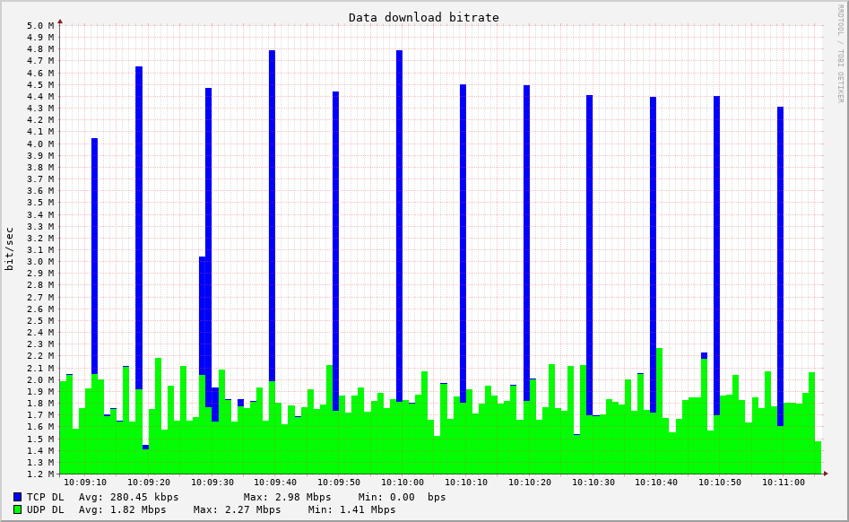
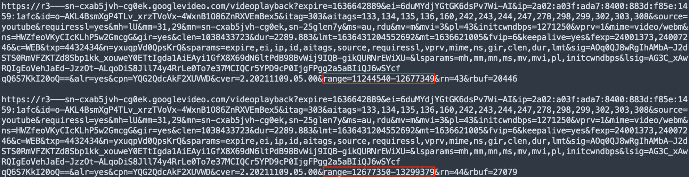

Application of QoE Parameters for a YouTube Activity and Discord Call
=====================================================================
.. sectionauthor:: Clément Delzotti, Vincent Higginson

.. Application of the previous discussed QoE parameters on a pragmatic analyzis with an everyday web application called YouTube.

Using the same resources as previous chapters, a YouTube activity was dissected alongside a Discord call. This comparison is really useful to understand how these two services work, are resilient and ensure a proper QoE. The next figure details the analyzed situation. Subsequent explanations assume the reader has knowledge about UDP, TCP and HTTP.

  YouTube's activity and Discord call packets sniffing

As you may know by taking a look at the image, two different network models are used. The first one (with a green colour) is UDP. During our experiments, we assume Discord is using it while YouTube is using TCP (green colour). There is a fundamental difference between YouTube and Discord. The last one is a live service, data is discovered at the same time it’s created (by a webcam, a microphone). A contrario, with the first one, the whole video to be seen is already known at the beginning of viewing. Both of these approaches are subject to underlying optimization to ensure a proper QoE.

Concerning YouTube, blue spikes are to be noticed. Occurring each 10 seconds, a little download “burst” is launched by YouTube. As said previously, the whole video is stored on one of Google’s server. It can be assumed that YouTube is feeding a video buffer with each 10 seconds in our specific case [1]. Those bursts coincide with higher level HTTP calls. Notice the range parameter being modified by a specific offset at each interval.

  HTTP calls resulting in download bursts to feed video buffer

Therefore, it is relevant to talk about QoE. The motivation between this burst can be as simple as resilience in case of temporary network disconnection. Moreover, assuming the browser is discarding video buffer after reading it, a 10 seconds buffer is often useful to allow a basic search (forward, backward play). And lastly, if the player is not sure about the quality of the connection, it's safer to download a little more in high quality in case it has to fallback to lower quality in the future. The fact the player managed to get a good quality fragment in the past hides the network failure the user encounter in the present. QoE was stable all along while QoS clearly dropped.

On the other hand, as previously saied, Discord can't use this interesting burst technique to ensure a continuous comfort during a voice and video call. Remember that data are transmitted from a user to another at the same time this data is created. Discord is using the H.264 codec to transmit video data. To understand why it influences QoE, it's mandatory to apprehend the basic of a video codec and compression algorithm. As it's not the purpose of this project to deeply understand the ins and outs of a typical H.264 stream, an intuitive description will suffice. A video perceived by an entity is divided into multiple frames. Each frame is an array of RGB(A) values. Intuitively, one may think of streaming frame by frame. However, this naive approach require huge requirements (basic math: 1024px by 768px of 32bits = 24Mbits for 1/24sec) nearly impossible to meet on today's and (next 10 years') hardware. Nonetheless, notion of video is rooted to the notion of time and change. Codecs such as H.264 choose to transmit not whole frames, but rather changes occurring over time. It's always easier to send only differences that occured between last frame and present frame than sending the whole pixels array.

This a priori fixed by H.264, and by many other video codecs, influences the QoE in two possible ways. The first one is clearly evident: this optimization allows everyone to watch video on a daily basis. This advantage is present in every possible situations where a video is watched, and not stick to a network situation, but still related to QoE as many codecs aren't lossless. However, the true advantage of H.264 resides in its resilience regarding packets drop. Indeed, see [7]_, an application displaying a H.264 doesn't stop when packets can't make their way through the network. A network hazard just means an artifact is to be seen by the user, an artifact supposed to disappear.

.. [7] _ https://escholarship.org/content/qt77t6z812/qt77t6z812.pdf 